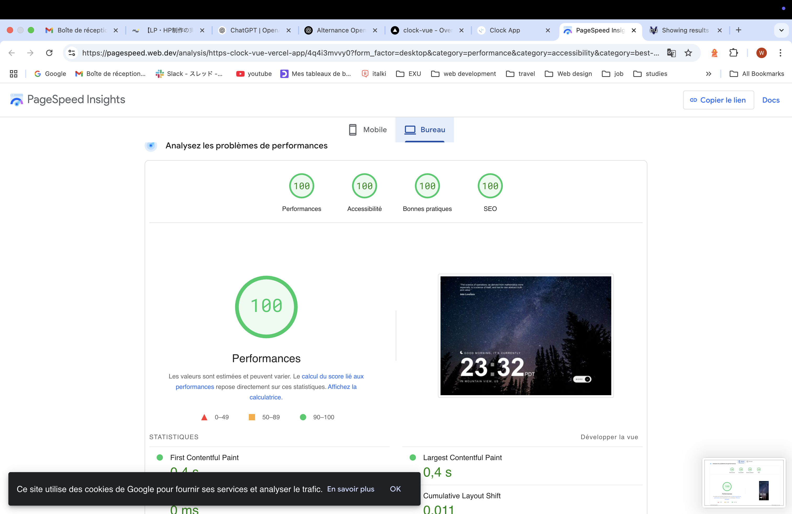
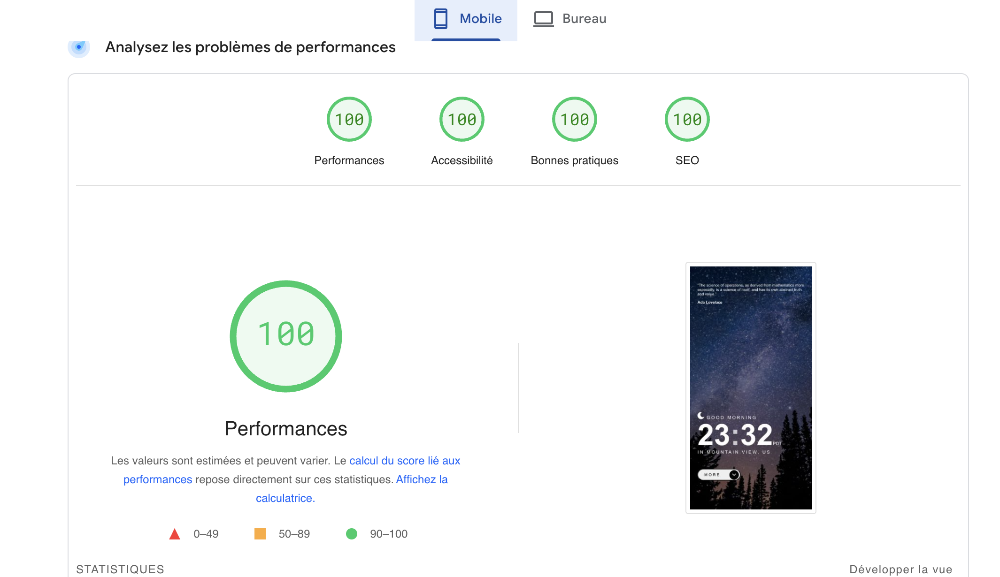

# clock-vue

This web application is designed by frontendmentor.io.

## The stack:

I used:

- Vue 3
- Sass

## Project Setup

```sh
npm install
```

### Compile and Hot-Reload for Development

```sh
npm run dev
```

### Compile and Minify for Production

```sh
npm run build
```

## Problem I encountered

The API offered by frontendmentor didn't work.

## Performances



